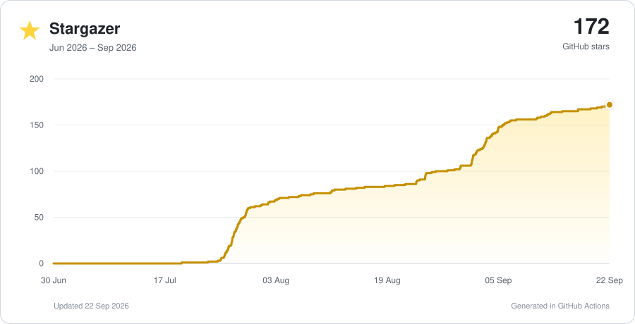

# L.L.E. — Legacy Lockscreen Effects

Bring lockscreen effects from old Samsung, LG, and Sony devices back to modern devices without root.

Every lockscreen effect is recreated 1:1 using the original sources.

**Current stable release:** `1.0.6.2` · **Recommended build:** ARM64

[Download the latest release](https://github.com/Brazzo978/L.L.E-Legacy-Lockscreen-Effects/releases/latest)
· [Watch the effect showcase](https://youtu.be/RO4WV7Z48Sk)
· [Read the XDA thread](https://xdaforums.com/t/app-beta-no-root-l-l-e-legacy-samsung-lockscreen-effects.4794942/)
· [Telegram support group](https://t.me/legacylockscreeneffect)
· [L.L.E Companion](https://github.com/Brazzo978/LLE-Companion)

> **Open source and local by design.** L.L.E's source code is published so its
> permission and data handling can be inspected. The app does not request the
> Android `INTERNET` permission: lockscreen captures, imported wallpapers,
> settings, effect caches, and debug reports remain on the device. L.L.E does
> not automatically upload them. Data leaves the phone only when you explicitly
> export or share a file yourself.

Source availability makes the official project auditable, but it cannot prove
that an APK from an unrelated mirror was built from this source. Download only
from the official GitHub release and verify the supplied SHA-256 checksum.

## Start here

Choose the installation method:

- **Recommended:** [install the APK manually](https://github.com/Brazzo978/L.L.E-Legacy-Lockscreen-Effects/blob/codex/lle-unified/LLEUnified/docs/INSTALL_APK.md) —
  complete illustrated Samsung setup, Play Protect, Accessibility, and
  Restricted Settings flow.
- **Computer/advanced:** [install or update with ADB](https://github.com/Brazzo978/L.L.E-Legacy-Lockscreen-Effects/blob/codex/lle-unified/LLEUnified/docs/INSTALL_ADB.md).
- **More details:** [complete setup and troubleshooting](https://github.com/Brazzo978/L.L.E-Legacy-Lockscreen-Effects/blob/codex/lle-unified/LLEUnified/README.md).
- **Problems or questions:** [read the L.L.E. FAQ](https://github.com/Brazzo978/L.L.E-Legacy-Lockscreen-Effects/blob/codex/lle-unified/LLEUnified/docs/FAQ.md).
- **XDA Thread:**[XDA](https://xdaforums.com/t/app-no-root-l-l-e-legacy-samsung-lockscreen-effects.4794942/)

The first-launch wizard configures Accessibility, battery optimization,
wallpaper dimming, lockscreen capture, enabled features, and the touch region.

### Samsung Restricted Settings

On recent Samsung firmware, a sideloaded Accessibility app may be blocked the
first time:

1. In the L.L.E wizard, open Accessibility.
2. Open **Installed apps → L.L.E** and try to enable the service once.
3. If Samsung blocks it, return to L.L.E.
4. Follow **Open App info → ⋮ → Allow restricted settings**.
5. Return to Accessibility and enable L.L.E.

The **Allow restricted settings** menu item may not appear until after the first
blocked activation attempt. The
[illustrated APK guide](https://github.com/Brazzo978/L.L.E-Legacy-Lockscreen-Effects/blob/codex/lle-unified/LLEUnified/docs/INSTALL_APK.md) shows every screen.

## Current builds

| Build | ABI | Status |
|---|---|---|
| **L.L.E** | `arm64-v8a` | Recommended and actively developed |
| **L.L.E 32** | `armeabi-v7a` | Historical continuity; critical fixes only |

New features and effects target ARM64. The 32-bit edition remains available for
older compatible devices but is no longer developed in parallel.

## General compatibility

L.L.E. is not limited to Samsung phones. It is designed for Android 6.0 or
newer and does not require root. The current **L.L.E** build is recommended
for modern `arm64-v8a` devices; the frozen 32-bit build is retained only for
older `armeabi-v7a` devices and does not receive the full set of new effects or
diagnostic features.

Exact behaviour can still vary between manufacturers, Android and vendor
updates, GPUs, lockscreen implementations, and battery-management policies.
Protected or dynamic wallpapers may require a manually supplied background,
while aggressive battery restrictions can prevent the effect service from
remaining ready. Complete the setup wizard, allow Accessibility, select a
matching lockscreen source, configure the touch area, and allow unrestricted
battery use before testing. Fold devices must complete the separate Cover and
Main display setup.

### If an effect does not work: send a debug report

On **L.L.E**:

1. Update to the latest official release and complete the setup wizard.
2. Reproduce the problem once: lock the phone, try the affected effect, and
   remember exactly what failed.
3. Open L.L.E and scroll to **Setup & permissions**.
4. Tap **Create debug report** and wait for Android's share sheet to open.
5. Send the generated `.txt` file through the
   [Telegram support group](https://t.me/legacylockscreeneffect), the
   [XDA thread](https://xdaforums.com/t/app-no-root-l-l-e-legacy-samsung-lockscreen-effects.4794942/),
   or an existing relevant GitHub issue.

Along with the report, include the device model, Android/vendor software
version, selected effect, what you expected, what actually happened, and
whether the problem occurs every time. Attach a separate screenshot or short
video when the problem is visual, because the debug report never includes
wallpapers or images.

The standard report is text-only and intended for support, but it can contain
recent diagnostic log text: review the file before posting it publicly. Never
post **Create advanced log (unredacted)** publicly. That advanced report can
contain notification or Accessibility text, app names, filenames, paths, and
exact touch coordinates; create it only when a trusted maintainer specifically
requests it for private troubleshooting.

## Included effects

- S3 None
- S3 Water Ripple
- S4 Lens Flare
- S5 Popping Colours, Stone Skipping, and Brilliant Ring
- N2 Ink in Water / Indigo
- N3 Watercolor and Ripple Ink
- N4 Abstract Tiles and Geometric Mosaic
- N5 Colored Droplet, Gyro Droplet, and Sparkling Bubbles
- Tab S Blind and Brilliant Cut
- Good Lock Popping Color, Rectangle Traveller, and Bouncing Color
- LG G1 White Hole and Dewdrop
- LG G2 Soda, Particle, Light Particle, Pixelate, and Crystal
- Sony Xperia Z1 Blinds and Revolving Glass
- Seasonal Spring, Summer, Autumn, and Winter effects
- Charging doodles and seasonal companion effects

## Requirements

- Android 6.0 or newer.
- An ARM64 device for the current recommended build.
- Accessibility permission.
- Unrestricted battery use is strongly recommended.
- A lockscreen capture or user-provided wallpaper and a configured touch box.
- No root access is required.

## Fold support

Fold mode stores separate Cover and Main configurations:

- lockscreen background;
- touch box;
- effect enable/disable state;
- doodle enable/disable state.

Complete each part of the dual-panel wizard while the requested display is
active. When Samsung does not expose a panel-specific wallpaper layer, use
automatic capture or provide the Cover/Main images manually.

## Privacy and permissions

L.L.E has no `INTERNET` permission. Its main permissions are used for:

- **Accessibility:** detect lockscreen state and display the selected effect;
- **Battery optimization exemption:** keep the renderer ready between
  lock/unlock cycles;
- **Wallpaper access:** optional local import or setting of a user-selected
  wallpaper;
- **Wake lock:** keep short effect and capture operations reliable.

The debug-report button creates a local text file for troubleshooting. It is not
sent anywhere automatically.

## Known limitations

- Vendor lockscreen behavior can change after a system update.
- Protected or layered wallpapers may require manual image selection.
- Samsung nighttime wallpaper dimming can make captured and displayed
  brightness differ; disabling that option is strongly recommended.
- Fold wallpaper APIs do not expose every Cover/Main layer to third-party apps.
- Some very HEAVY effect will not show properly on low end smartphones.

## Star history

  <a href="https://github.com/Brazzo978/L.L.E-Legacy-Lockscreen-Effects/stargazers">
    <picture>
      <source media="(prefers-color-scheme: dark)" srcset="assets/star-history-dark.svg">
      <source media="(prefers-color-scheme: light)" srcset="assets/star-history.svg">
      
    </picture>
  </a>

Thank you to everyone who has starred and supported L.L.E.

<a href="https://support.legacylockscreeneffects.app">L.L.E will always be free - but if you insist... ♡</a>

## License

Project-authored source code is available under the
[PolyForm Noncommercial License 1.0.0](https://github.com/Brazzo978/L.L.E-Legacy-Lockscreen-Effects/blob/codex/lle-unified/LICENSE.md).
