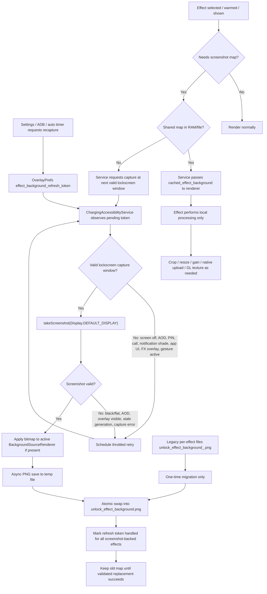

# Effect Background Screenshot Workflow

This document describes the shared screenshot workflow used by LLE lockscreen
effects that need a lockscreen color/background map.

## Core Rule

The screenshot is owned by `ChargingAccessibilityService`, not by individual
effects.

All screenshot-backed effects consume the same base file:

```text
files/unlock_effect_background.png
```

Each effect may crop, resize, gain-adjust, upload, or otherwise transform that
base map for its own renderer, but it must not own the recapture policy.

## Block Diagram



## Operational Notes

- `touch_box_lockscreen.png` is only for the touch-box wizard and must not be
  used as the effect colormap.
- `unlock_effect_background.png` is shared by all screenshot-backed effects.
- The service keeps the previous valid map until a new screenshot is validated
  and atomically swapped.
- Capture is blocked while an unlock effect overlay, gesture, PIN entry,
  notification shade, call UI, AOD, or the LLE settings UI is visible.
- Retry is throttled so lockscreen polling cannot spam screenshots every 10 ms.
- The hard-wake refresh activity only arms the service. The service still owns
  validation, capture, save, and sleep/lock cleanup.
- Legacy files such as `unlock_effect_background_2.png` are migration sources
  only. They are copied into the shared file and are not part of runtime policy.

## Main Code Paths

- `OverlayPrefs.effectBackgroundFile(...)`
  returns the shared `unlock_effect_background.png`.
- `ChargingAccessibilityService.refreshUnlockEffectBackgroundSourceIfNeeded(...)`
  decides whether capture is needed.
- `ChargingAccessibilityService.canCaptureUnlockEffectBackground()`
  gates capture to a clean lockscreen window.
- `ChargingAccessibilityService.isValidUnlockEffectBackgroundScreenshot(...)`
  rejects bad frames.
- `ChargingAccessibilityService.persistEffectBackgroundScreenshotAsync(...)`
  writes and swaps the shared PNG.
- `BackgroundSourceRenderer.setBackgroundSourceBitmap(...)`
  is the consumption point for effects.
