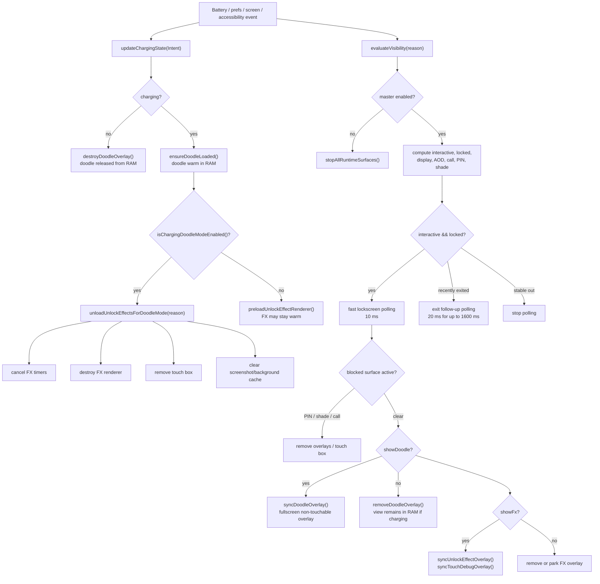
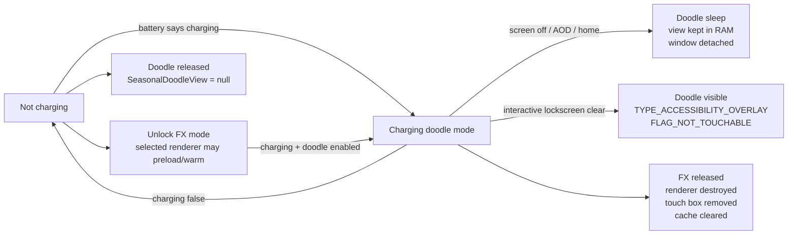

# L.L.E. runtime workflow and memory notes

Date: 2026-07-07

Scope: advanced app `charging-touch-test-apk`, package `com.codex.lle`.

Primary code:

- `charging-touch-test-apk/src/com/codex/lle/ChargingAccessibilityService.java`
- `charging-touch-test-apk/src/com/codex/lle/ControlActivity.java`
- `charging-touch-test-apk/src/com/codex/lle/OverlayPrefs.java`

## Current runtime rule

Charging doodle and lockscreen unlock effects are mutually exclusive runtime modes.

- Charging doodle mode is active when:
  `masterEnabled && charging && showDoodle && showLock`
- In charging doodle mode:
  - doodle may be loaded in RAM;
  - doodle is visible only on the interactive lockscreen;
  - AOD/home do not show the doodle;
  - unlock FX renderer, touch box, pending FX timers and screenshot cache are unloaded.
- When not charging:
  - doodle overlay is destroyed and released from RAM;
  - unlock FX may preload/warm normally if enabled.

## Block diagram



## Memory lifecycle diagram



## Current code anchors

| Area | Method / line |
| --- | --- |
| Visibility reconciliation | `ChargingAccessibilityService.evaluateVisibility(...)`, around line 943 |
| `showDoodle` / `showFx` gate | around lines 1076 and 1078 |
| Doodle attach path | `syncDoodleOverlay()`, around line 1154 |
| Doodle RAM load gate | `ensureDoodleLoaded()`, around line 1202 |
| FX preload gate | `preloadUnlockEffectRenderer()`, around line 1301 |
| Doodle-mode FX unload | `unloadUnlockEffectsForDoodleMode()`, around line 2255 |
| Doodle-mode idempotency guard | `hasUnlockEffectRuntimeState()`, around line 2279 |
| Doodle visibility rule | `isDoodleVisible(...)`, around line 2661 |
| Charging doodle mode rule | `isChargingDoodleModeEnabled()`, around line 2670 |
| Charging state update | `updateChargingState(...)`, around line 3227 |
| Lockscreen polling loop | `runLockscreenSessionPoll()`, around line 744 |

## Optimizations applied in this pass

- Doodle is lockscreen-only at visibility level.
- Doodle remains warm in RAM only while charging and doodle is enabled.
- Doodle is destroyed when charging stops.
- Unlock FX preload is blocked during charging doodle mode.
- Unlock FX runtime state is unloaded during charging doodle mode.
- FX unload is idempotent, so fast polling does not repeatedly destroy already released state.
- Doodle `WindowManager.addView()` is guarded with `try/catch` to avoid service crash on inconsistent overlay state.
- AOD/Home doodle toggles were removed from the UI because those modes are no longer valid product behavior.

## In-app effect profiler

The lockscreen effect tab now has an `Effect memory` card.

Behavior:

- The first real lockscreen gesture for an effect automatically captures a process memory sample.
- The UI only shows the last real-run sample; it does not start synthetic effect benchmarks.
- `Sample next run` clears the selected effect's sampled token, so the next actual gesture refreshes that effect's sample.
- The sampling delay is intentionally short and one-shot, so the hot path does not carry a continuous profiler.

Benchmarking is diagnostic-only and must be triggered through ADB.

Stored values:

- SharedPreferences key `effect_profile_last_summary`: last readable result shown in the UI.
- SharedPreferences key `effect_profile_diagnostic_summary`: last ADB-only profile/benchmark status.
- SharedPreferences key `effect_profile_running`: benchmark progress flag.
- SharedPreferences key `effect_profile_last_csv`: last CSV path.
- SharedPreferences key `effect_profile_sample_token`: generation token used by the service for one-shot real-run sampling.
- SharedPreferences key prefix `effect_profile_sampled_token_`: per-effect token already sampled.
- CSV file: `/data/user/0/com.codex.lle/files/effect_profile_benchmark.csv`.

Important behavior:

- If charging doodle mode is active, FX profiling/benchmarking is blocked because the app intentionally unloads unlock effects in that mode.
- Disable the doodle or unplug charging before benchmarking unlock effects.
- The in-app profiler measures process PSS, Java/native heap summaries, graphics PSS where Android exposes it, and gesture sync/begin timings from the real run.
- GPU cache and gralloc buffers still require `adb shell dumpsys gfxinfo com.codex.lle` for authoritative readings.

ADB diagnostic actions:

```powershell
adb shell am broadcast -a com.codex.lle.DEBUG_UNLOCK_EFFECT_PROFILE -p com.codex.lle --ei effect 0
adb shell am broadcast -a com.codex.lle.DEBUG_UNLOCK_EFFECT_BENCHMARK -p com.codex.lle
adb shell run-as com.codex.lle cat files/effect_profile_benchmark.csv
```

## ADB memory snapshot

This is a live snapshot from the attached phone, not a full per-effect benchmark.

Device:

- Model: `SM-S918B`
- Android: `16`
- Package: `com.codex.lle`
- Battery at snapshot: USB powered, charging status `2`, level `82%`
- Prefs at snapshot: `show_doodle=true`, `show_lock=true`, `unlock_effect_enabled=true`, `unlock_effect=0` (`S4 Lens Flare`)
- Visible roots at snapshot: `ControlActivity` hidden, `LLEUnlockEffect` invisible/parked, `LLETouchListenBox` visible

`adb shell dumpsys meminfo com.codex.lle`:

| Metric | Value |
| --- | ---: |
| Total PSS | 98,223 KB |
| Total RSS | 99,336 KB |
| Total Swap PSS | 37,236 KB |
| Java Heap PSS | 13,064 KB |
| Native Heap PSS | 4,224 KB |
| Code PSS | 16,692 KB |
| Graphics PSS | 8,020 KB |
| Views | 44 |
| ViewRootImpl | 3 |
| Bitmap malloced | 80 / 25,143 KB |

`adb shell dumpsys gfxinfo com.codex.lle`:

| Metric | Value |
| --- | ---: |
| Pipeline | Skia Vulkan |
| Total CPU graphics cache | 94.93 KB |
| Total GPU graphics cache | 78.00 KB |
| GraphicBufferAllocator estimate | 23,290 KB |
| Imported gralloc buffers | 23,568 KB |
| Janky frames | 106 / 985, 10.76% |
| 50th percentile frame | 7 ms |
| 90th percentile frame | 14 ms |
| 95th percentile frame | 44 ms |
| 99th percentile frame | 600 ms |

Important reading of the snapshot:

- The largest visible graphics cost is the touch listen box buffer set, about 23 MB gralloc.
- The Java/native heap is modest compared with graphics/buffer cost.
- This snapshot is not sufficient to compare all effects because it is a single runtime state.

## Per-effect benchmark plan

To make the memory table authoritative, repeat the same capture for each effect after selecting it and letting the lockscreen settle.

Commands:

```powershell
adb shell dumpsys meminfo com.codex.lle
adb shell dumpsys gfxinfo com.codex.lle
adb shell run-as com.codex.lle cat shared_prefs/overlay_prefs.xml
adb shell run-as com.codex.lle cat files/effect_profile_benchmark.csv
adb shell dumpsys battery
```

Suggested rows:

| Effect / mode | Total PSS | RSS | Swap PSS | Graphics PSS | GPU cache | Gralloc | Notes |
| --- | ---: | ---: | ---: | ---: | ---: | ---: | --- |
| Charging doodle mode | TBD | TBD | TBD | TBD | TBD | TBD | Expected FX unloaded |
| S4 Lens Flare | 98,223 KB | 99,336 KB | 37,236 KB | 8,020 KB | 78 KB | 23,568 KB | Current single snapshot |
| S5 Popping Colours | TBD | TBD | TBD | TBD | TBD | TBD | Needs controlled sample |
| N4 Abstract Tiles | TBD | TBD | TBD | TBD | TBD | TBD | Native lockbg renderer |
| NE Geometric Mosaic | TBD | TBD | TBD | TBD | TBD | TBD | Native lockbg renderer |
| N5 Colour Droplet | TBD | TBD | TBD | TBD | TBD | TBD | Native physics effect |
| N5 Sparkling Bubbles | TBD | TBD | TBD | TBD | TBD | TBD | Higher lag/crash risk |
